# Darwin Trader — System Architecture & Living Engineering Standards

## System Overview & Technology Stack

**Darwin Trader** (`AntaresAndBharani/darwin-trader`) is an enterprise-grade algorithmic trading platform engineered for MetaTrader 5 (MT5) with an asynchronous Terminal User Interface (Textual TUI), a high-performance Python quantitative strategy execution and backtesting engine, and a FastAPI gateway providing real-time 1Hz WebSocket telemetry streaming and REST controls.

The platform is purpose-built to comply with **Darwinex Zero** institutional evaluation metrics, prioritizing capital preservation, strict daily drawdown constraints, dynamic volatility-adjusted position sizing, multi-asset taxonomy discovery, and algorithmic consistency to maximize the Darwinex D-Score.

```mermaid
graph TD
    subgraph PresentationTier ["Presentation Layer (Terminal UI & API Gateway)"]
        subgraph TuiClient ["Terminal User Interface Client (tui/)"]
            TextualApp["Textual TUI Application (tui.app: DarwinTraderApp)"]
            TuiScreens["Modal Screens (AssetExplorerModal, ConnectModal, ConfirmModal)"]
            TuiWidgets["Reactive Widgets (SummaryCards, StrategyPanel, PositionsTable, HeaderBar)"]
            TuiClientWrapper["DarwinApiClient (httpx.AsyncClient & Resilient Reconnect)"]
        end

        subgraph GatewayTier ["Gateway & Communications Layer (api_gateway/)"]
            FastApiApp["FastAPI Application Server (main.py, Uvicorn)"]
            WsEndpoint["WebSocket 1Hz Push Stream (/ws/live)"]
            StrategyRoutes["Strategy Control Router (/api/v1/strategy)"]
            AccountRoutes["Account Telemetry Router (/api/v1/account)"]
            AssetRoutes["Asset Discovery & Taxonomy Router (/api/v1/assets)"]
            GatewayLock["Gateway State Synchronization Lock (_state_lock: threading.Lock)"]
        end
    end

    subgraph StrategyTier ["Quantitative Strategy & Execution Engine (strategy_engine/)"]
        StratBase["Abstract Base Strategy & Technical Indicators (strategy_base.py)"]
        ActiveStrat["DarwinTrendStrategy: EMA Crossover + RSI + ATR (sample_strategy.py)"]
        RiskEngine["Darwinex Zero Risk Manager & Dynamic Sizing (risk_manager.py)"]
        BacktestEngine["Quantitative Bar-by-Bar Backtester (backtester.py)"]
        Connector["MT5 Connector & Hardware Abstraction (mt5_connector.py)"]
        SymbolCache["Double-Checked Locking Asset Cache (_symbols_cache: dict)"]
        ConfigState["Global Strategy Configuration (config.py: StrategyConfig)"]
    end

    subgraph BrokerTier ["Broker Infrastructure & Execution Targets"]
        LiveMT5["MetaTrader 5 Windows Terminal (Win32 IPC terminal64.exe)"]
        MockMT5["Platform-Independent Mock Engine (In-Memory Order Book & 8-Symbol Catalog)"]
    end

    subgraph QualityTier ["Quality & Agentic Governance Subsystems"]
        PytestSuite["Pytest Suite (api_gateway/tests, strategy_engine/tests, tui/tests)"]
        AgenticSDLC["5-Node Agentic SDLC (Architect, Three Amigos, Dev-Test, PR Review, Backlog)"]
    end

    TextualApp --> TuiScreens
    TextualApp --> TuiWidgets
    TextualApp -->|User Keybindings & Modals| TuiClientWrapper
    TuiClientWrapper -->|Async HTTP & WebSocket Feed| FastApiApp

    FastApiApp --> StrategyRoutes
    FastApiApp --> AccountRoutes
    FastApiApp --> AssetRoutes
    FastApiApp --> WsEndpoint

    StrategyRoutes --> GatewayLock
    AccountRoutes --> GatewayLock
    AssetRoutes --> GatewayLock
    WsEndpoint --> GatewayLock

    GatewayLock --> ConfigState
    GatewayLock --> Connector
    Connector --> SymbolCache
    Connector --> StratBase
    StratBase --> ActiveStrat
    ActiveStrat --> RiskEngine
    RiskEngine --> Connector
    BacktestEngine --> ActiveStrat

    Connector -->|Live Windows Execution (Win32 IPC)| LiveMT5
    Connector -->|Simulated Execution / Linux CI| MockMT5

    QualityTier -.->|Service Testing| GatewayTier
    QualityTier -.->|Algorithmic Verification| StrategyTier
    QualityTier -.->|UI Pilot Testing| TuiClient
```

### Technology Stack & Framework Specifications

| Tier / Subsystem | Technology | Specification / Version | Architectural Role |
|---|---|---|---|
| **Terminal UI (TUI)** | Textual & Rich | Textual `>=0.70.0`, Rich `>=13.0.0` | Asynchronous, keyboard-driven ANSI dashboard with interactive modals and differential tables |
| **Asynchronous HTTP Client** | HTTPX | HTTPX `>=0.24.0` | Asynchronous connection-pooled HTTP client with resilient retry and offline fallbacks |
| **Backend Framework** | FastAPI & Uvicorn | FastAPI `>=0.100.0`, Uvicorn `>=0.22.0` | Asynchronous REST gateway, asset catalog routes, and 1Hz WebSockets push streaming |
| **Data Validation & Schemas** | Pydantic | Pydantic v2 (`>=2.0.0`) | High-performance Rust-backed schema validation, serialization, and typing |
| **Quantitative Computing** | Pandas & NumPy | Pandas `>=2.0.0`, NumPy `>=1.24.0` | Vectorized technical indicators, rolling series, and historical bar backtesting |
| **Broker Integration** | MetaTrader 5 Python SDK | `MetaTrader5 >= 5.0.45` (Windows conditional) | Win32 IPC bridge to MT5 trading terminals (`terminal64.exe`) with error code translation |
| **Testing Infrastructure** | Pytest | Pytest `>=7.0.0`, pytest-asyncio, pytest-randomly | Unit, integration, route validation, and headless TUI pilot testing |

### Execution Modes & Simulation Architecture

On the backend, execution mode is governed by `StrategyConfig.mock_mode`:
- **Live Mode (`mock_mode = False`)**: Establishes live Win32 IPC with the MetaTrader 5 terminal process on Windows. Supports attaching to already-running terminal instances or initiating sessions with broker credentials.
- **Mock Simulation Mode (`mock_mode = True`)**: Activates an in-memory execution engine with virtual tickets, synthetic account balance, simulated tick fills, and an 8-symbol asset catalog fixture (`AMZN`, `NVDA`, `MSFT`, `PM`, `AAPL`, `SPY`, `QQQ`, `EURUSD`). Allows full backend and UI verification on Linux, macOS, and headless CI runners where the proprietary MT5 Windows binary cannot execute.

---

## Layer Boundaries & Clean Architecture (Domain, Data, Presentation/UI separation of concerns)

The Darwin Trader ecosystem enforces strict **Clean Architecture** boundaries and **Unidirectional Data Flow**. Dependencies strictly point inward toward domain models and business invariants. Outer layers depend on inner abstractions; inner layers possess zero knowledge of outer frameworks, UI toolkits, or network transports.

```mermaid
graph RL
    subgraph PresentationLayer ["Presentation Layer (TUI, Widgets, Screens, Routers)"]
        TuiApp["Textual TUI Widgets & Screens (tui/)"]
        FastApiRouters["FastAPI Routers (routes_strategy, routes_account, routes_assets)"]
    end

    subgraph DataLayer ["Data & Infrastructure Layer (Networking, Brokers, DTOs, Mappers)"]
        TuiApiClient["DarwinApiClient (tui.api_client)"]
        MT5Conn["MT5 Connector & Mock Engine (strategy_engine.mt5_connector)"]
        DoubleCheckCache["Double-Checked Locking Catalog Cache (_symbols_cache)"]
        ConfigMgr["Configuration Manager (strategy_engine.config)"]
    end

    subgraph DomainLayer ["Domain Layer (Business Logic, Entities, Algorithms, Contracts)"]
        DomainEntities["Domain Entities (models.py: Candle, Position, AccountInfo, AssetInfo, TradeSignal)"]
        RiskRules["Risk Management Engine (risk_manager.py: RiskManager)"]
        StrategyAlgorithms["Strategy Base & Indicator Math (strategy_base.py, sample_strategy.py)"]
        BacktestCore["Quantitative Simulation Engine (backtester.py: Backtester)"]
    end

    PresentationLayer -->|Invokes| DataLayer
    PresentationLayer -->|Observes & Dispatches| DomainLayer
    DataLayer -->|Implements Contracts & Maps DTOs| DomainLayer
```



### 1. Domain Layer (Pure Business Core)

The Domain layer is the heart of the platform. It defines enterprise trading models, risk guardrails, technical analysis algorithms, and operational business rules:

- **Responsibilities:**
  - **Core Financial & Asset Entities (`strategy_engine/models.py`)**:
    - Defines domain entities (`Candle`, `TradeSignal`, `Position`, `AccountInfo`, `StrategyState`, `ConnectionStatus`, `AssetInfo`) and domain enumerations (`OrderType`, `SignalType`, `StrategyStatus`, `ConnectionState`, `AssetCategory`).
    - Models are strictly immutable or validated using Pydantic v2 with explicit schema configurations (`model_config = ConfigDict(extra="ignore")`).
  - **Darwinex Zero Risk Guardrails (`strategy_engine/risk_manager.py`)**:
    - Enforces institutional evaluation rules:
      1. Maximum open position limits (`max_open_positions`).
      2. Hard daily floating drawdown caps (`max_daily_drawdown_pct`, default 3.0%).
      3. Safety warning buffer threshold (`drawdown_warning_pct`, default 2.5%).
      4. Minimum free margin buffers (`free_margin >= balance * 0.05`).
      5. Volatility-adjusted dynamic position sizing (`calculate_lot_size`) based on Stop Loss pips and ATR.
  - **Technical Indicator Algorithms (`strategy_engine/strategy_base.py`)**:
    - Pure mathematical, vectorized implementations of Exponential Moving Average (`calculate_ema`), Relative Strength Index (`calculate_rsi`), and Average True Range (`calculate_atr`).
  - **Quantitative Simulation Engine (`strategy_engine/backtester.py`)**:
    - Bar-by-bar historical backtesting simulation calculating equity curves, Win Rates, Profit Factors, and Maximum Drawdowns without network, disk, or broker dependencies.
- **Architectural Invariants:**
  - **Zero External Framework Dependencies**: The Python domain core must not import FastAPI, Uvicorn, or MetaTrader5.
  - **Deterministic & Pure**: Indicator math and risk calculations must be pure functions with deterministic outputs for given inputs, enabling comprehensive unit testing without mocks.

### 2. Data & Infrastructure Layer

The Data layer bridges domain logic with external hardware, operating systems, and network protocols:

- **Responsibilities:**
  - **MetaTrader 5 Hardware Abstraction (`strategy_engine/mt5_connector.py`)**:
    - Encapsulates Win32 IPC interaction with `MetaTrader5` on Windows platforms.
    - Provides thread-safe order execution (`execute_order`), multi-symbol position querying (`get_open_positions`), and account telemetry extraction (`get_account_info`).
    - Captures discretionary and manual trades (`magic == 0`) alongside strategy orders.
    - Maps numeric MT5 error codes to human-readable diagnostic messages via `MT5_ERROR_MESSAGES` and `format_mt5_error()`.
    - Supports attaching to an already-running MT5 terminal instance without requiring password re-entry.
    - Provides a full-featured in-memory **Mock Engine** when operating on non-Windows hosts or when `mock_mode = True`, simulating order deal tickets, floating P&L calculations, and margin requirements.
    - Implements the Emergency Kill Switch (`close_all_positions`), liquidating active tickets in a thread-safe loop.
  - **Asset Discovery & Catalog Caching Engine (`strategy_engine/mt5_connector.py`)**:
    - Thread-safe discovery of tradeable instruments via `get_available_assets(category, search)` and `get_asset_info(symbol)`.
    - Employs **double-checked locking** and shallow snapshot copying (`list(self._symbols_cache.values())`) under `self._lock` to eliminate dictionary mutation race conditions during concurrent reads and cache invalidations.
    - Decouples static contract specifications from on-demand live tick queries (`bid`/`ask`), gracefully degrading quotes to `None` during closed market hours.
  - **Configuration Infrastructure (`strategy_engine/config.py`)**:
    - Manages strategy parameters, indicator periods, broker server configurations, and credentials extracted from environment variables with safe defaults.
    - Implements safe parameter resetting (`reset_from`) using Pydantic model copying without touching private internals.
  - **Terminal Networking (`tui/api_client.py`)**:
    - `DarwinApiClient`: Manages an asynchronous HTTP client session (`httpx.AsyncClient`) with connection pooling, explicit keep-alive, extended action timeouts (15s for kill-switch/connect), and offline error translation.
- **Architectural Invariants:**
  - Low-level network or broker exceptions must be captured and translated into domain status models (`ConnectionState.DISCONNECTED`, `ConnectionState.ERROR`) rather than bubbling unhandled to the presentation layer.
  - All disk and network I/O must execute asynchronously or on designated background thread pools (`asyncio.to_thread` for blocking Win32 MT5 IPC in Python).

### 3. Presentation & UI Layer

The Presentation layer renders telemetry, captures trader input, and dispatches trading commands:

- **Responsibilities:**
  - **Terminal User Interface (`tui/`)**:
    - `DarwinTraderApp`: Textual application managing full-screen layouts, reactive message loops, keybindings (`F1`, `F2`/`C`, `F3`/`A`, `P`, `K`, `R`, `Q`), and modal dialogs.
    - `HeaderBar`: Top telemetry bar with dual-glyph accessibility badges (`[● CONNECTED]`, `[○ DISCONNECTED]`), latency metrics, and server info.
    - `SummaryCards`: Overview cards for Balance, Equity, Margin, and Floating P&L with responsive 2x2 grid collapsing on small viewports (<80 columns).
    - `StrategyPanel`: Execution state badges (`[● RUNNING]`, `[⏸ PAUSED]`), total exposure lots, and 3-tier Darwinex Zero drawdown badges (`[● SAFE]`, `[⚠ WARNING]`, `[⛔ BREACH]`).
    - `PositionsTable`: Keyed row differential reconciliation using `DataTable.update_cell` to preserve row selection identity during 1Hz telemetry updates.
    - `AssetExplorerModal`: Interactive modal screen with category filtering (`stocks`, `etfs`, `forex`, `all`), real-time search, and contract specifications inspection.
    - `ConnectModal` & `ConfirmModal`: Interactive dialogs for broker authentication and safeguarded emergency liquidation confirmation.
  - **API Gateway Routers (`api_gateway/routes_*`)**:
    - `routes_strategy.py`: REST endpoints for strategy state manipulation (`/start`, `/pause`, `/stop`, `/kill-switch`, `/config`).
    - `routes_account.py`: REST endpoints for account authentication, connection status, open positions, and telemetry.
    - `routes_assets.py`: REST endpoints for asset catalog discovery and single-symbol specification lookups.
    - `main.py`: WebSocket push streaming at 1Hz over `/ws/live`.
- **Architectural Invariants:**
  - UI components must never instantiate broker SDKs or execute direct raw database queries.
  - All UI state updates must be differential and non-blocking to prevent UI freezing during 1Hz stream processing.

---

## Directory & Package Structure Guidelines

The directory structure enforces strict modular separation by technical concern, domain responsibility, and clean architectural boundaries:

```
darwin-trader/
├── .github/                                      # GitHub Actions CI/CD workflows and issue templates
│   ├── ISSUE_TEMPLATE/                           # Issue templates (user-story.yml, subtask.yml)
│   ├── workflows/                                # CI workflows (build.yml, dev-test.yml)
│   └── workflows/prompts/                        # CI governance prompts
├── .graph/                                       # Living architecture specifications & local pipeline worktrees
│   ├── architecture.md                           # Authoritative System Architecture & Living Engineering Standards
│   └── worktrees/                                # Git worktrees for parallel agentic development and testing
├── api_gateway/                                  # FastAPI Asynchronous Gateway
│   ├── __init__.py                               # Package initialization
│   ├── main.py                                   # FastAPI entrypoint, CORS configuration, and WebSocket stream
│   ├── requirements.txt                          # Gateway runtime dependencies (fastapi, uvicorn, pydantic, textual)
│   ├── routes_account.py                         # Account connection, telemetry, positions, and Darwinex stats
│   ├── routes_assets.py                          # Asset taxonomy, discovery, search, and specification routes
│   ├── routes_strategy.py                        # Strategy start, pause, stop, kill-switch, and config routes
│   └── tests/                                    # Gateway integration and unit tests
│       ├── conftest.py                           # Pytest fixtures, test client setup, and mock state
│       ├── test_api.py                           # Endpoint test suite verifying HTTP & status behaviors
│       └── test_assets.py                        # Asset discovery, category filtering, and contract spec tests
├── strategy_engine/                              # Quantitative Strategy Engine & MT5 Integration
│   ├── __init__.py                               # Package initialization
│   ├── backtester.py                             # Bar-by-bar quantitative simulation engine
│   ├── cli_history.py                            # CLI historical data sync and purge utilities
│   ├── config.py                                 # Pydantic configuration model and environment loading
│   ├── models.py                                 # Core trading models, signals, positions, assets, enums
│   ├── mt5_connector.py                          # MetaTrader 5 Win32 IPC connector & platform mock engine
│   ├── requirements.txt                          # Strategy runtime dependencies (pandas, numpy, MetaTrader5)
│   ├── risk_manager.py                           # Darwinex Zero risk validation and dynamic lot sizing
│   ├── sample_strategy.py                        # Reference quantitative strategy (EMA + RSI + ATR)
│   ├── strategy_base.py                          # Abstract base strategy and vectorized indicator math
│   └── tests/                                    # Strategy, risk, connector, and governance test suites
│       ├── test_assets_connector.py              # Thread-safe asset catalog and category filtering tests
│       ├── test_cli_history.py                   # Parallel sync and granular purge tests
│       ├── test_mobile_decommission.py           # Mobile decommission regression tests
│       ├── test_pipeline_governance_alignment.py # Pipeline and governance alignment tests
│       └── test_strategy.py                      # Unit tests for indicators, signals, risk caps, backtester
├── tui/                                          # Terminal User Interface Dashboard (Textual)
│   ├── __init__.py                               # Package initialization
│   ├── __main__.py                               # Entrypoint for `python -m tui`
│   ├── api_client.py                             # Asynchronous HTTP/WebSocket client with fallback
│   ├── app.py                                    # Main Textual App class, keybindings, and layout
│   ├── screens/                                  # Full-screen views and modal dialogs
│   │   ├── __init__.py                           # Export screens
│   │   ├── asset_explorer_modal.py               # Interactive tradeable asset catalog and search modal
│   │   ├── confirm_modal.py                      # Safeguarded action confirmation modal
│   │   └── connect_modal.py                      # MT5 Account Connection modal dialog
│   ├── widgets/                                  # Reusable Textual UI widgets
│   │   ├── __init__.py                           # Export widgets
│   │   ├── header_bar.py                         # Top telemetry bar with dual-glyph status badges
│   │   ├── positions_table.py                    # Keyed differential reconciliation positions table
│   │   ├── strategy_panel.py                     # Strategy state, drawdown badge, and exposure widget
│   │   └── summary_cards.py                      # Financial overview cards with responsive grid collapse
│   └── tests/                                    # Headless TUI pilot tests
│       └── test_tui.py                           # Pilot tests verifying rendering, modals, and keybindings
├── docs/                                         # Project documentation and visual artifacts
│   ├── draft-requisites/                         # Implementation proposals, review logs, BDD specs
│   └── screenshots/                              # Validated visual test evidence
├── logs/                                         # Execution logs for local-pipeline tasks
├── scripts/                                      # Automation scripts, test runners, local pipeline
│   ├── local-pipeline/                           # Antigravity / Task Scheduler local automation nodes
│   │   ├── register-local-tasks.ps1              # Registers Windows Task Scheduler agent jobs
│   │   ├── run-architect.ps1                     # Local Architect node (batch decomposition)
│   │   ├── run-backlog-triage.ps1                # Local Backlog Triage node
│   │   ├── run-pr-review.ps1                     # Local PR Review node
│   │   └── run-three-amigos-and-dev-test.ps1     # Local Dev-Test & Three Amigos runner
│   └── run-tui.ps1                               # Interactive TUI dashboard launcher script
├── CHANGELOG.md                                  # Keep a Changelog historical record
├── GEMINI.md                                     # Agent context, quick commands, and guidelines
├── pytest.ini                                    # Pytest configuration and path settings
└── README.md                                     # System overview, quickstart, and feature catalog
```

---

## Design Patterns, State Management & Concurrency

### 1. Concurrency & Dual-Lock Synchronization Pattern (Gateway & Strategy Engine)

Algorithmic trading demands strict concurrency guarantees to prevent race conditions during order dispatch, position closure, asset discovery, and configuration updates:

1. **Gateway State Lock (`api_gateway.routes_strategy._state_lock`)**:
   - A module-level `threading.Lock()` synchronizing high-level route mutations (updating `global_config`, transitioning `current_status`, dispatching order actions).
2. **Connector Lock (`strategy_engine.mt5_connector.MT5Connector._lock`)**:
   - A reentrant lock (`threading.RLock()`) protecting internal mock positions, balance counters, asset catalog caches, and direct Win32 IPC invocations.
3. **Non-Blocking Thread-Pool Delegation for MT5 Win32 IPC**:
   - `mt5.initialize()`, `mt5.login()`, and `mt5.symbols_get()` can block for **2 to 10 seconds** when resolving remote broker servers over Win32 sockets.
   - Calling blocking functions directly inside async FastAPI routes holding `_state_lock` freezes the entire event loop and starves concurrent telemetry streams.
   - **Architectural Rule**: Long-running broker initialization must execute off the main event loop using `asyncio.to_thread` or a background executor, acquiring the lock only for shared state assignment.

```python
# Concurrency pattern for broker authentication without event-loop starvation
@router.post("/connect", response_model=AccountConnectResponse)
async def connect_account(request: AccountConnectRequest) -> AccountConnectResponse:
    # 1. Non-blocking off-thread execution of blocking Win32 MT5 initialization
    success, message = await asyncio.to_thread(
        connector.initialize_with_credentials,
        login=request.login,
        password=request.password,
        server=request.server,
        path=request.path,
        mock_mode=request.mock_mode
    )
    
    # 2. Acquire state lock only for instantaneous state synchronization
    with _state_lock:
        if not success:
            return AccountConnectResponse(status="ERROR", message=message, error=message)
        acc = connector.get_account_info()
        return AccountConnectResponse(status="CONNECTED", message=message, account_info=acc)
```

### 2. Double-Checked Locking & Shallow Snapshot Caching Pattern (Asset Catalog)

Retrieving thousands of symbol specifications from MetaTrader 5 over Win32 IPC is computationally expensive and subject to dictionary mutation race conditions during concurrent HTTP queries:
- **Double-Checked Locking**: The catalog cache TTL is checked before and after acquiring `self._lock`, avoiding redundant IPC queries across threads.
- **Shallow Snapshot Copying**: To avoid `RuntimeError: dictionary changed size during iteration` when client filters iterate over the catalog, the connector always creates a shallow snapshot list (`list(self._symbols_cache.values())`) under `self._lock` before applying category and substring search filters.
- **Cache Invalidation on Account Switch**: Switching broker accounts or disconnecting immediately clears `self._symbols_cache` and resets `self._cache_timestamp = 0.0`.

```python
# Double-checked locking with shallow snapshot copying
def get_available_assets(self, category: Optional[str] = None, search: Optional[str] = None) -> List[AssetInfo]:
    if not self.config.mock_mode and not self.is_connected:
        raise ConnectionError("MetaTrader 5 gateway disconnected")

    with self._lock:
        # Check cache TTL and refresh if expired
        if not self._symbols_cache or (time.time() - self._cache_timestamp > self._cache_ttl):
            self._refresh_symbols_cache_locked()

        # Shallow snapshot under lock prevents dictionary modification during iteration
        snapshot = list(self._symbols_cache.values())

    # Filter operations execute safely on snapshot
    results = snapshot
    if category and category != "all":
        results = [a for a in results if a.category.lower().startswith(category.lower())]
    if search:
        s_lower = search.lower()
        results = [a for a in results if s_lower in a.symbol.lower() or s_lower in a.description.lower()]
    return results
```

### 3. Hardware Abstraction & Mock Simulation Strategy (Platform-Independence Pattern)

Proprietary MetaTrader 5 Python bindings only execute on Windows operating systems with an installed `terminal64.exe` client. To achieve cross-platform portability across macOS, Linux development environments, and GitHub Actions CI containers:
- `MT5Connector` inspects `platform.system() == "Windows"` and safely handles `ImportError` on non-Windows platforms.
- When `mock_mode = True` or when the MT5 library is absent, the connector seamlessly routes all operations to an internal in-memory execution engine.
- Simulates realistic ticket generation (`_mock_ticket_counter`), spreads, margin allocation (`$200.00` per position), floating PnL calculation, and a deterministic 8-symbol mock catalog fixture (`AMZN`, `NVDA`, `MSFT`, `PM`, `AAPL`, `SPY`, `QQQ`, `EURUSD`).
- Guarantees 100% test coverage and CI verification on headless Ubuntu GitHub Actions runners.

### 4. Emergency Kill-Switch Pattern (Fail-Safe Portfolio Liquidation)

In automated algorithmic trading, the emergency kill switch is the most critical safety mechanism:
- **Idempotent Multi-Ticket Liquidation**: Sequentially loops through all active positions, issuing closing deal orders (`TRADE_ACTION_DEAL` with inverse order types) directly to the broker.
- **Discretionary Trade Coverage**: Liquidates all open positions across all asset classes, including manual trades (`magic == 0`), ensuring zero floating exposure.
- **Zero-Position Safety Guard**: If invoked when zero positions are open, the system transitions strategy status to `PAUSED` without dispatching redundant network cancellation orders, avoiding broker rejection errors.
- **Fail-Safe State Transition**: Immediately halts strategy signal evaluation by forcing `StrategyStatus.PAUSED`, preventing new orders from entering the market while liquidation is in flight.

### 5. Quantitative Signal-Driven Trading Pattern (Strategy Base & Risk Decorator)

Trade generation follows a strict multi-tier pipeline:
1. **Historical Bar Ingestion**: Ingests pandas DataFrames containing OHLCV bars.
2. **Indicator Computation**: Calculates vectorized indicators (EMA, RSI, ATR) on historical series.
3. **Signal Evaluation**: Evaluates trend crossover and momentum thresholds to generate a `TradeSignal`.
4. **Pre-Trade Risk Verification**: The signal is intercepted by `RiskManager.validate_signal()`. The signal is discarded if daily drawdown caps, max open positions, or margin limits are breached.
5. **Dynamic Position Sizing**: If validated, `RiskManager.calculate_lot_size()` dynamically computes lot volume based on stop-loss distance and account risk percentage before dispatching to `MT5Connector.execute_order()`.

```
[OHLCV Bar Feed] 
       │
       ▼
[Indicator Math (EMA, RSI, ATR)] 
       │
       ▼
[Strategy Signal Generator] ────► Emits TradeSignal (ENTER_LONG / ENTER_SHORT)
       │
       ▼
[RiskManager.validate_signal()] ─► Validates: Drawdown < 3%, Positions < 2, Margin > 5%
       │
       ├─► [REFUSED] ──────────► Discarded with logged reason
       ▼
[RiskManager.calculate_lot_size()] ─► Dynamic sizing based on SL pips & 1% risk
       │
       ▼
[MT5Connector.execute_order()] ────► Dispatches Deal to MT5 Win32 IPC / Mock Engine
```

### 6. Darwinex Zero Tiered Drawdown Guardrail Pattern

Darwinex Zero enforces an uncompromising 3.0% maximum daily floating drawdown limit. To safeguard the account from catastrophic termination, the platform implements a 3-tier reactive monitoring system:
- **Tier 1: Safe Zone (`< 2.0% Drawdown`)**: Normal trading operations; green status badging (`[● SAFE]`).
- **Tier 2: Warning Buffer (`>= 2.5% Drawdown`)**: Active risk mitigation alert; amber status badging (`[⚠ WARNING]`). New trade signal generation is paused; existing positions are closely monitored with trailing stops.
- **Tier 3: Hard Breach Cap (`>= 3.0% Drawdown`)**: Critical risk limit; red alert badging (`[⛔ BREACH]`). System automatically halts trading, dispatches emergency liquidation, and prevents new order generation.

### 7. Hybrid WebSocket-First Push Streaming with Polling Fallback

Real-time telemetry architecture balances low-latency responsiveness with network resilience:
- **Primary Push Channel**: Clients open a persistent WebSocket connection to `/ws/live`, receiving 1Hz JSON snapshots containing balance, equity, floating PnL, margin, D-Score, open positions, and strategy status.
- **Fallback Polling Channel**: If the WebSocket connection drops, clients seamlessly fall back to polled REST endpoints (`GET /api/v1/account/status`, `GET /api/v1/account/positions`) with exponential backoff (2s to 5s) until the WebSocket stream reconnects.
- **Poller Suspension During Authentication**: Background telemetry polling is explicitly suspended while an account connection request (`POST /api/v1/account/connect`) is in-flight, preventing network race conditions and lock contention.

### 8. Textual TUI Differential Table Reconciliation Pattern

To eliminate visual flicker and preserve row selection state in terminal dashboards:
- Rather than clearing and rebuilding the `DataTable` on every 1Hz update, `PositionsTable` maintains keyed row identity tracking (`ticket`).
- Executes differential cell updates using `DataTable.update_cell(row_key, column_key, value)`, mutating only changed prices or P&L values.
- Retains stale cache when the gateway is unreachable (`ACTIVE POSITIONS [STALE / OFFLINE CACHE]`), preventing blank screens during brief connection hiccups.
- Implements automatic responsive collapsing: collapses horizontal summary cards into a 2x2 grid when the viewport falls below 80 columns or 24 rows.

---

## Architectural Constraints & Anti-Patterns

### Strict Architectural Constraints

1. **Inward-Only Dependency Rule**:
   - The presentation layer must never directly import or interact with broker SDKs (`MetaTrader5`) or low-level network transports. All operations must flow through Routers or API clients.
   - Domain models (`strategy_engine/models.py`), risk rules (`strategy_engine/risk_manager.py`), and indicator algorithms (`strategy_engine/strategy_base.py`) must remain pure Python with zero UI framework or broker SDK imports.
2. **Non-Blocking Main Thread & Structured Concurrency**:
   - In FastAPI, blocking Win32 MT5 SDK calls (`mt5.initialize`, `mt5.login`, `mt5.order_send`, `mt5.symbols_get`) must never execute directly inside `async def` route handlers. They must be dispatched via `asyncio.to_thread()`.
3. **Mandatory Pre-Trade Risk Verification**:
   - No strategy signal may be dispatched to the broker or mock engine without first passing `RiskManager.validate_signal()`. Bypassing risk controls is an intolerable safety violation.
4. **Platform-Agnostic Core Verification**:
   - All backend code must execute cleanly under Linux and macOS using `mock_mode = True` without requiring physical MetaTrader 5 Windows binaries.
5. **Strict Concurrency Protection & Snapshot Isolation**:
   - Shared mutable state in Python (active positions, running status, global config, symbol catalogs) must be guarded by synchronization locks (`_state_lock` or `MT5Connector._lock`).
   - Iterations over dictionary caches must always operate on shallow snapshot copies (`list(cache.values())`) under lock.
6. **Pydantic v2 Schema Hygiene**:
   - Models handling external API responses or broker queries must configure `model_config = ConfigDict(extra="ignore")` or explicit field aliases to prevent runtime crashes caused by unexpected JSON payload keys.
7. **Zero Hardcoded Secrets or Machine-Specific Paths**:
   - Never commit passwords, broker login IDs, or user-specific executable paths into git repositories. All credentials must be injected via environment variables (`MT5_LOGIN`, `MT5_PASSWORD`, `MT5_SERVER`) or runtime configuration forms.
8. **Acyclic Package Graph**:
   - The dependency graph must strictly follow: `models` → `strategy_base` → `risk_manager` / `sample_strategy` → `mt5_connector` → `api_gateway`. Circular imports between packages are strictly prohibited.

### Architectural Anti-Patterns & Solutions

| Anti-Pattern | Violation Scenario | Required Architectural Solution |
|---|---|---|
| **Blocking Event Loop with Win32 IPC** | Calling `mt5.initialize()` or `mt5.login()` directly inside an `async def` FastAPI endpoint. | Wrap blocking Win32 calls in `await asyncio.to_thread(...)` to prevent freezing the server event loop. |
| **Global Lock Starvation During Connect** | Holding `_state_lock = threading.Lock()` across a 10-second blocking MT5 terminal connection attempt. | Execute connection logic off-thread; acquire `_state_lock` only for instantaneous state assignments upon completion. |
| **Dictionary Mutation During Concurrent Iteration** | Iterating over `self._symbols_cache.values()` while another thread is updating or clearing the cache. | Acquire `self._lock` and extract a shallow snapshot copy (`list(self._symbols_cache.values())`) before iterating or filtering. |
| **Unsynchronized WebSocket Reads** | Reading `connector.get_account_info()` from the WebSocket loop without acquiring connector locks while config is being updated. | Synchronize all connector reads and mutations using `MT5Connector._lock` (`threading.RLock()`). |
| **Bypassing Risk Controls** | Executing orders directly from strategy signals without calling `RiskManager.validate_signal()`. | Route every signal through `RiskManager.validate_signal()` before calculating lot sizes or invoking `execute_order()`. |
| **Ignoring Discretionary Trades in Risk Checks** | Filtering open positions strictly by `magic_number`, ignoring manual orders (`magic == 0`) that consume account margin and drawdown. | Retrieve all open positions across symbols and include `magic == 0` when calculating margin, drawdown, and kill-switch liquidation. |
| **Modifying Pydantic Private Internals** | Manipulating `__dict__` or `__pydantic_fields_set__` directly to reset configuration fields. | Use `source = other.model_copy(update=overrides)` and iterate over `model_dump().items()`, as implemented in `StrategyConfig.reset_from()`. |
| **Unprotected Kill-Switch Double-Dispatch** | Allowing rapid repeated clicks on "Kill Switch" to dispatch concurrent liquidation loops. | Implement UI button debouncing, immediately disable confirmation buttons on click, and ensure backend liquidation loops are idempotent. |
| **Full Table Clearing on Telemetry Updates** | Invoking `DataTable.clear()` and rebuilding rows every second in the TUI positions table, resetting user row selection. | Perform differential keyed updates using `DataTable.update_cell` to preserve row identity and selection state. |
| **Hardcoded Machine Paths in Git** | Committing hardcoded terminal paths (`C:\Program Files\...`) into repository files. | Read defaults from `os.getenv("MT5_PATH")` and allow dynamic overrides via UI configuration forms. |
| **Uncoordinated Polling During Connect** | TUI client polling `/status` and `/positions` while `/connect` is processing, timing out and showing false disconnect banners. | Suspend background telemetry polling while account authentication requests are active; resume on response or timeout. |

---

## Definition of Done (DoD) for Architecture Updates

When proposing architectural refactors, introducing new layers, or extending core features:

1. **Automated Verification**:
   - Test suite passes: `pytest api_gateway/tests strategy_engine/tests tui/tests`
   - Zero errors, zero failures, 100% green pass.
2. **Clean Architecture Compliance**:
   - Architectural boundaries (`domain`, `data`, `presentation`) are strictly respected.
   - Zero MetaTrader5 imports in base strategy or domain models.
3. **Living Documentation Synchronization**:
   - Any modifications to data contracts, layer topologies, or design patterns must be immediately synchronized with `.graph/architecture.md`.
4. **Changelog Maintenance**:
   - Add a descriptive, structured entry under `## [Unreleased]` in `CHANGELOG.md` adhering to the Keep a Changelog standard.
5. **Remote CI Gate**:
   - Push to feature branch `feat/[task-summary]`, open Pull Request with comprehensive Mission Plan, and verify remote GitHub Actions checks (`gh pr checks` / `gh run watch`) achieve **100% Green / Passing** status.
